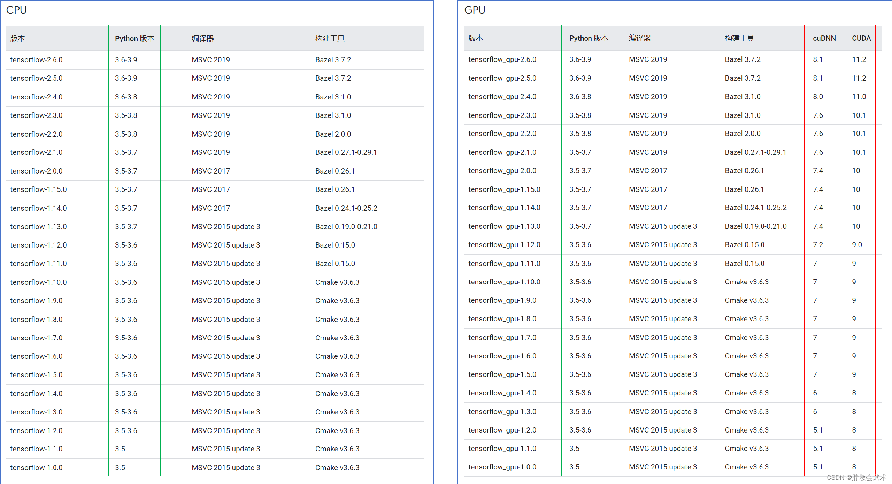
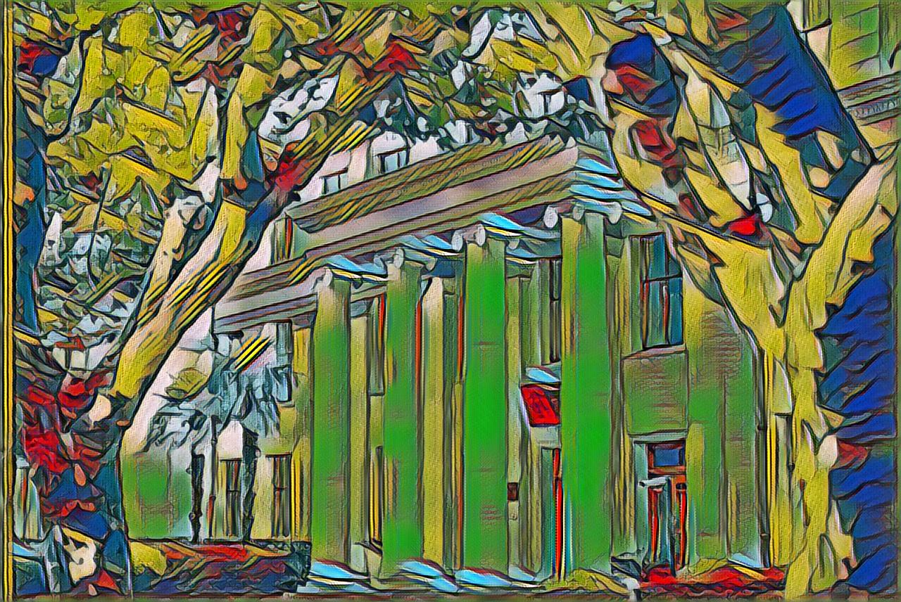

# OrangeTools
数字图像处理平台

# 一、功能列表

1. 自定义风格迁移
2. 固定风格迁移：糖果、星空、毕加索、缪斯、马赛克、神奈川冲浪里、达达注意、呐喊、羽毛
3. 基础功能：共39个。
    椒盐噪声、均值平滑、中值平滑、高斯平滑；
    图像锐化-拉普拉斯算子、图像锐化-Sobel算子水平方向、图像锐化-Sobel算子垂直方向、
    将图像用双线性插值法扩大、
    将图像左移30个像素，下移50个像素、
    旋转45度，缩放因子为1、
    转灰度图、转灰度后二值化-全局阈值法、
    直方图均衡化、灰度直方图、
    仿射变换、透视变换、图像翻转、
    RGB转HSV、HSV获取H、HSV获取S、HSV获取V、
    RGB获取B、RGB获取G、RGB获取R、
    水平翻转、垂直翻转、对角镜像、
    图像开运算、图像闭运算、腐蚀、膨胀、
    顶帽运算、底帽运算、
    HoughLinesP实现线条检测、 Canny边缘检测、
    图像增强、
    Roberts算子提取图像边缘、Prewitt算子提取图像边缘、Laplacian算子提取图像边缘、LoG边缘提取。

# 二、技术栈

## 2.1前端开发

- 主要开发语言：HTML,CSS,JavaScript
- 前端框架：Vue.js
- 脚手架：Vue-CLI
- UI：ElementUI
- 代码编辑器：Pycharm
- 数据交换：axios
- 前端包管理器：npm
- 前端构建工具：Webpack

## 2.2后端开发

- 开发语言:Python
- 后端框架：Flask
- 代码编辑器：Pycharm
- 版本控制系统：Git
- 跨域工具：flask-cors

# 三、项目运行

## 3.1 安装依赖

1. 根据实际显卡型号以及tensorflow-gpu（安装cpu版本也可）的版本要求，在本地安装CUDA和cuDNN
   

2. 在本地环境或虚拟环境中安装tensorflow_gpu库
   ```Plain
   pip install tensorflow_gpu==2.6.0
   ...
   ```
## 3.2 修改配置

`config.py` 文件中修改配置信息。

## 3.3 前端操作

首先在terminal中进入firstend文件夹，依次输入以下命令启动。

```Bash
# install dependency
npm install
# develop
npm run dev
```

## 3.4 后端操作

在Pycharm 中运行 `app.py` 。

# 四、功能展示

## 固定风格迁移：

### Candy


### The Starry Night


### Composition VII


### La Muse


### Mosaic


### かながわおきなみうら


### Udnie


### The Scream


### Feathers


